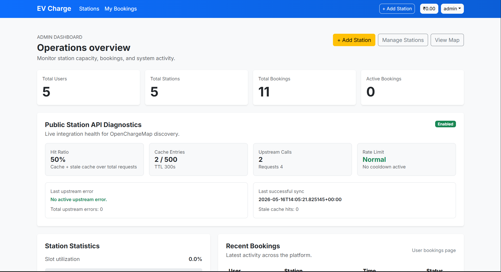
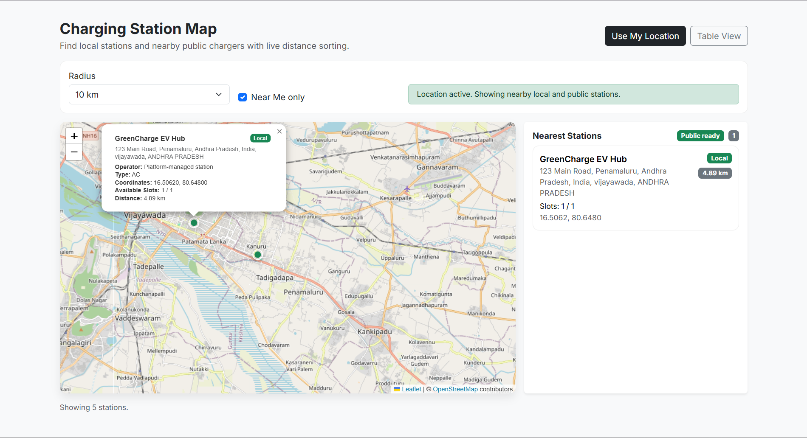
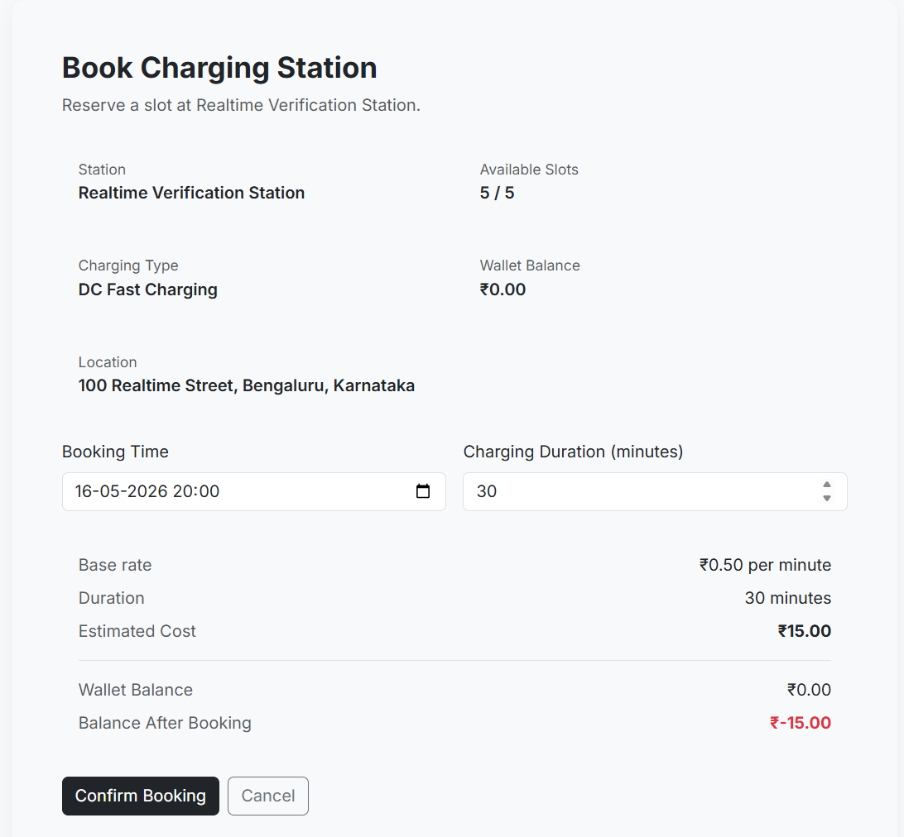
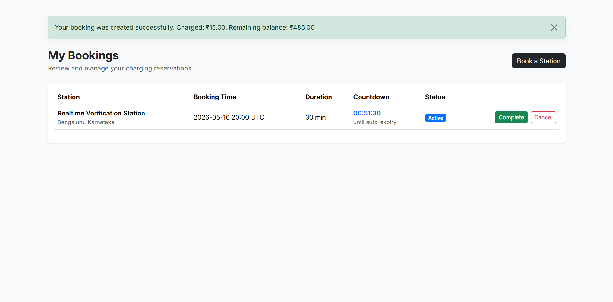
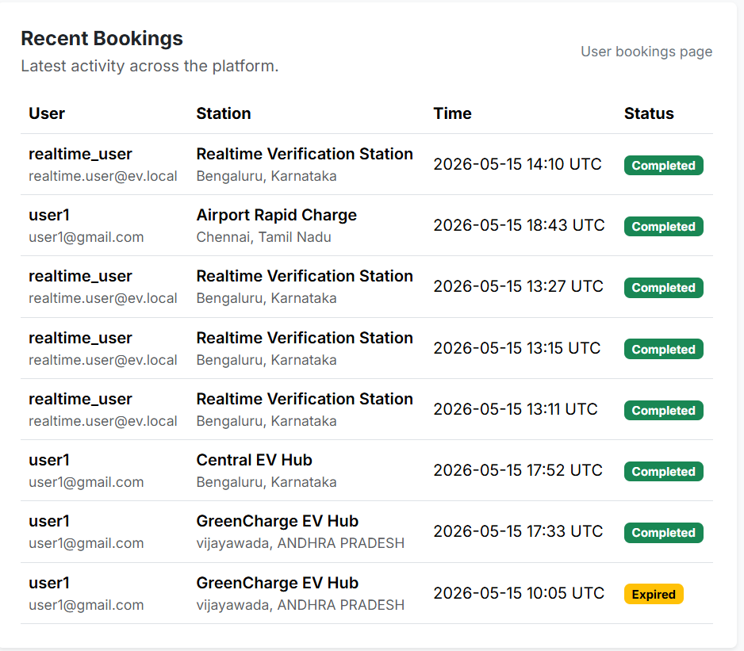
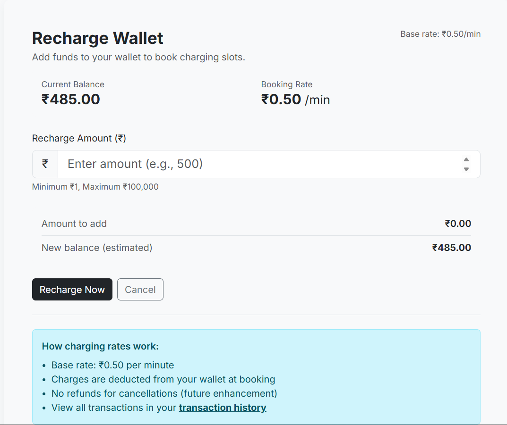

# EV Charging Slot Booking Platform

Realtime geospatial EV mobility platform for discovering nearby charging stations, reserving slots, managing wallet recharges, and monitoring operations in real time.

Built with Flask, PostgreSQL, Flask-SocketIO, Leaflet.js, Chart.js, and OpenChargeMap integration, this project is designed like a production SaaS control plane rather than a simple CRUD demo.

## Overview

The platform combines local station booking workflows with public EV station discovery and a realtime analytics dashboard. Users can locate nearby charging stations through browser geolocation, filter by radius, reserve time slots, recharge wallet balances, and track booking lifecycle changes instantly. Admins get operational visibility through Socket.IO-powered updates, Chart.js analytics, and diagnostics for public station discovery.

The system distinguishes between:

- Local stations: owned or managed stations that support booking, availability, and wallet-driven business workflows.
- Public stations: OpenChargeMap-powered nearby stations displayed for discovery only, with no booking entitlement in the platform.

## Features

- Flask backend with modular route and service architecture
- PostgreSQL support for production-grade persistence
- Flask-SocketIO realtime synchronization across user and admin dashboards
- WebSocket lifecycle handling for connect, reconnect, sync, and disconnect flows
- Realtime booking lifecycle updates for create, complete, cancel, and expiry events
- Wallet recharge and transaction history flows
- Role-based access control for admin and user experiences
- Browser geolocation with radius-based nearby station discovery
- Leaflet.js map rendering for local and public EV stations
- OpenChargeMap API integration for external public charging discovery
- Chart.js analytics dashboard for bookings, recharges, status distribution, and top stations
- Operational diagnostics for OpenChargeMap cache, retry, and rate-limit behavior
- CI realtime smoke tests to validate websocket event flow
- Render-ready deployment configuration
- Responsive UI for mobile and desktop
- Environment-variable secret management for production safety

## Screenshots

Captured UI screenshots from the running app (stored in the repository `screenshots/` folder):

- Dashboard overview: 
- Map and nearby stations: 
- Booking flow (reserve): 
- My bookings: 
- Recent bookings list: 
- Wallet recharge flow: 

## Technology Stack

| Layer | Technologies | Purpose |
|---|---|---|
| Backend | Flask, Flask-Login, Flask-Migrate, SQLAlchemy | App routing, auth, ORM, migrations |
| Realtime | Flask-SocketIO, Eventlet, WebSockets | Live updates and dashboard synchronization |
| Database | PostgreSQL, SQLite (dev/CI) | Durable production storage and local development |
| Frontend | Jinja2, Bootstrap, Leaflet.js, Chart.js | Responsive UI, maps, analytics visualizations |
| Geospatial | Browser geolocation, Haversine distance, OpenChargeMap | Nearby station discovery and public EV station lookup |
| Deployment | Render, Gunicorn, WhiteNoise | Production hosting and static asset delivery |
| Testing | CI smoke harness, Flask test client, Socket.IO test client | Realtime event verification |
| Operations | Env vars, diagnostics, rate-limit handling, Redis optional cache | Secure and observable runtime behavior |

## System Architecture

```text
Browser
	├─ User dashboard / map / wallet
	├─ Admin dashboard / analytics
	└─ Socket.IO client
				│
				▼
Flask app factory
	├─ Routes: auth, bookings, payment, stations, dashboard
	├─ Services: realtime, admin analytics, booking lifecycle, OpenChargeMap
	├─ SQLAlchemy models
	└─ Flask-SocketIO event handlers
				│
				├─ PostgreSQL (production)
				├─ SQLite (local / CI smoke tests)
				└─ OpenChargeMap API (public EV stations)
```

### Project Structure

```text
.
├── app.py
├── config.py
├── extensions.py
├── requirements.txt
├── Procfile
├── render.yaml
├── migrations/
├── models/
├── routes/
├── services/
├── static/
├── templates/
├── scripts/
├── utils/
├── tests/
└── docs/ (add screenshots and release notes here)
```

## Realtime Architecture

The realtime layer uses Flask-SocketIO to synchronize state across connected clients. A user action such as creating a booking or completing a recharge emits a server-side event, which updates the relevant user room and the admin analytics room. The frontend listens for those events and updates the UI without a full page reload.

### Event flow

```text
Business action
	├─ booking created / completed / cancelled
	├─ wallet recharge completed
	└─ booking expiry sweep
				│
				▼
Server emits Socket.IO event
	├─ user-specific events: wallet:update, booking:update, notification:new
	└─ admin event: analytics:update
				│
				▼
Connected browsers update UI in place
```

### Synchronization model

- User sockets join a per-user room for private wallet and notification updates.
- Admin sockets join the `admins` room so operational analytics stay isolated from regular users.
- `sync:request` is used for controlled resynchronization after reconnects instead of continuous rebroadcasting.
- Business events drive analytics updates; heartbeat and reconnect flows do not.

## Geospatial Architecture

The geospatial experience combines browser location services with server-side distance filtering.

1. The browser requests geolocation permission.
2. The client sends latitude, longitude, and a radius to the backend.
3. The backend computes proximity and returns nearby local stations.
4. OpenChargeMap enriches the map with public stations for discovery only.
5. The map displays both sources with clear styling and source badges.

### Internal vs Public Stations

- Internal stations are platform-managed records and can be booked.
- Public stations come from OpenChargeMap and are shown for awareness, routing, and discovery.
- Public stations are intentionally marked non-bookable to preserve business logic integrity.

## OpenChargeMap Integration

OpenChargeMap is used as an external public EV station source to enrich the nearby station experience.

### Key behaviors

- Requests are radius-based and sorted by distance.
- Responses are normalized into the platform’s map schema.
- A TTL cache reduces repeated upstream calls.
- Rate-limit cooldowns protect the service from repeated failures.
- Diagnostics surface cache usage, upstream errors, and cooldown state to admins.

### Why this matters

The platform can provide a modern “nearby EV mobility” experience without owning every station in the ecosystem. Local stations drive booking revenue, while public stations improve discovery density and user trust.

## Installation

### 1. Clone the repository

```bash
git clone <your-repo-url>
cd ev-charging-slot-booking
```

### 2. Create and activate a virtual environment

Windows PowerShell:

```powershell
python -m venv venv
.\venv\Scripts\Activate.ps1
```

macOS / Linux:

```bash
python3 -m venv venv
source venv/bin/activate
```

### 3. Install dependencies

```bash
pip install -r requirements.txt
```

## Environment Variables

Copy `.env.example` to `.env` and set the values for your environment.

```bash
copy .env.example .env
```

### Required variables

| Variable | Purpose |
|---|---|
| `SECRET_KEY` | Flask session and signing secret |
| `DATABASE_URL` | PostgreSQL connection string in production |
| `OPENCHARGEMAP_API_KEY` | Optional OpenChargeMap API key |

### Recommended production variables

| Variable | Purpose |
|---|---|
| `FLASK_ENV` | Set to `production` on Render |
| `USE_WHITENOISE` | Serve static assets when needed |
| `SOCKETIO_ASYNC_MODE` | Typically `eventlet` in production |
| `OPENCHARGEMAP_ENABLED` | Toggle public EV discovery |
| `OPENCHARGEMAP_REDIS_URL` | Shared cache and rate-limit state for multi-instance deployments |

See [.env.example](.env.example) for the full reference.

## Database Migrations

Initialize and update the schema with Flask-Migrate:

```bash
flask db upgrade
```

Useful migration commands:

```bash
flask db migrate -m "describe your schema change"
flask db upgrade
flask db downgrade -1
```

If you are starting from scratch in a new environment, run `flask db upgrade` after setting `DATABASE_URL`.

## Local Development

### Start the application

```bash
flask run
```

or run the Socket.IO entrypoint directly:

```bash
python app.py
```

### Optional local seed data

```bash
flask seed run
```

This seeds demo users and stations for development. It is blocked in production unless explicitly enabled.

## Deployment on Render

This repository includes `render.yaml` for a Render deployment flow.

### Render setup

1. Create a new Web Service in Render.
2. Connect this GitHub repository.
3. Use the included build and start commands.
4. Provision a managed PostgreSQL instance.
5. Set environment variables in the Render dashboard.

### Render commands

Build command:

```bash
pip install -r requirements.txt
```

Start command:

```bash
gunicorn -k eventlet -w 1 -b 0.0.0.0:$PORT app:app --log-file -
```

### Production checklist

- Set `DATABASE_URL` to managed PostgreSQL
- Set `SECRET_KEY`
- Set `OPENCHARGEMAP_API_KEY` if public station lookup is enabled
- Set `USE_WHITENOISE=true`
- Run `flask db upgrade`
- Confirm `/health` returns HTTP 200

## Realtime Testing and CI

The realtime smoke test validates the end-to-end Socket.IO lifecycle:

- wallet recharge
- booking creation
- booking completion
- reconnect behavior
- `sync:request` handling

### Run the smoke harness locally

```bash
python scripts/realtime_e2e_verify.py
```

### What it verifies

- `wallet:update` still reaches the user room
- `notification:new` still reaches the user room
- `analytics:update` reaches the `admins` room after successful recharge and booking events
- reconnect and sync flows do not create recursive broadcast loops

The CI workflow in `.github/workflows/realtime-smoke.yml` runs this verification so regressions are caught before deployment.

## Security Features

- Environment-variable secret management for production configuration
- OpenChargeMap API key validation and safe logging
- Role-based access control for admin and user capabilities
- CSRF protection on form submissions
- Admin-only analytics visibility via the `admins` Socket.IO room
- Guardrails around production seeding to avoid accidental database pollution
- Realtime event separation between private user updates and operational admin data

## Performance Optimizations

- Chart.js instances are reused instead of recreated on every update
- Analytics datasets are replaced atomically to avoid infinite growth
- Client-side updates are throttled to reduce render pressure
- Realtime updates use `chart.update('none')` for low-overhead redraws
- OpenChargeMap responses are cached with TTL-based expiration
- Rate-limit cooldowns prevent repeated upstream failure loops
- WhiteNoise can serve static assets when platform static hosting is unavailable
- PostgreSQL connection pooling can be tuned via environment variables

## Roadmap

Planned and recommended enhancements:

- Dockerize the application for local parity and easier onboarding
- Add PostGIS support for richer spatial queries and radius indexing
- Centralize realtime analytics caching with Redis in multi-instance deployments
- Export operational metrics to Prometheus or OpenTelemetry
- Add richer station filters such as connector type, availability, and pricing
- Add itinerary planning and route-based charging suggestions
- Add production screenshot capture and case-study notes for GitHub portfolio use

## Learning Outcomes

This project demonstrates practical experience with:

- Realtime event-driven architecture
- WebSocket lifecycle management
- RBAC and secure admin isolation
- Geospatial UX design and nearby resource discovery
- Operational diagnostics and rate-limit handling
- Production deployment on Render
- Flask application factory and modular service design
- Chart.js performance tuning for dashboard workloads
- API integration and data normalization

## Additional Documentation

Supporting docs in this repository:

- [Deployment guide](DEPLOYMENT.md)
- [Testing workflow](TESTING.md)
- [Migration guide](MIGRATIONS.md)
- [Seeding guide](SEEDING.md)
- [Wallet and payment notes](WALLET_AND_PAYMENT.md)
- [RBAC architecture notes](RBAC_ARCHITECTURE.md)

## License

This project is released under the terms of the [LICENSE](LICENSE) file.